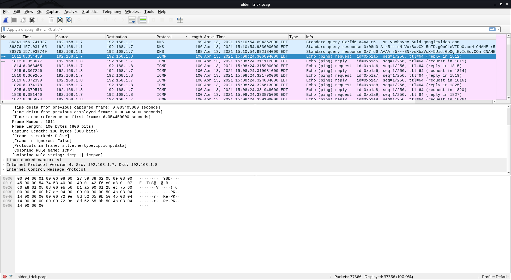

# Oldest Trick in the Book

The description for this challenge is as follows:

*A data breach has been identified. The invaders have used the oldest trick in the book. Make sure you can identify what got stolen from us.
This challenge will raise 33 euros for a good cause.*

This is a forensics challenge that I believe was rated at one out of four stars. 

**TL;DR Solution:** I noticed that the ping packets seemed to contain tiny bits of a zip file, so I pulled them out into a full file. The zip file contained a firefox profile folder, and decoding the user's saved passwords gave me the flag.

My first step was to open up the packet capture file with Wireshark. I decided that the most logical thing to do would be to order my packets by protocol, since I was hopeful that the exfiltration method would have used just one protocol, and this way it would potentially be more obvious with visual inspection. This was correct; I noticed some strings of English text in the data area of ICMP packets, which is not typical for normal operations. In addition, the first ICMP packet contains the string "PK", which is the file signature for a zip file. Some googling revealed that data exfiltration via ping definitely seems like an "old trick", so I'm definitely on the right track!



Next, I created a python script to process the relevant data out of the capture file and put it together in a new zip file. Basically, I filtered my packets down so that I was only dealing with ICMP packets, and selected one of the source IPs as another filter, since the requests and replies mean that all the data is doubled. I used the packets with plaintext strings to determine an appropriate slice of data to take from each packet, then I put them together into the my_output.zip file.

```
import pyshark

FILE = 'older_trick.pcap'
pcap = pyshark.FileCapture(FILE)


#print(pcap[1811].icmp)

answer = b''
for packet in pcap:
	try:
		relevant = packet.icmp.data
		if packet.ip.src == '192.168.1.7':
		
            #print(bytes.fromhex(relevant[48:80]))
			answer += bytes.fromhex(relevant[48:80])
			#break
	except Exception as e:
		pass
print(len(answer))

f = open("my_output.zip", "wb")
f.write(answer)
```

The contents of the zip file included files like key4.db, cookies.sqlite, logins.json, etc. All of this indicates that this is a Firefox profile folder. I attempted to grep the files for the standard flag format and found nothing, so I then decided to try to extract the saved passwords from the profile. I came across an effective script for this task called firefox_decrypt.py (see here: https://github.com/unode/firefox_decrypt) and ran it:
```
knittingirl@piglet:~/CTF/HTBApocalypse/ping_output$ python3 firefox_decrypt.py fini
2021-05-04 11:10:38,203 - WARNING - profile.ini not found in fini
2021-05-04 11:10:38,204 - WARNING - Continuing and assuming 'fini' is a profile location

Website:   https://rabbitmq.makelarid.es
Username: 'Frank_B'
Password: 'CHTB{long_time_no_s33_icmp}'

```

We have the flag!
